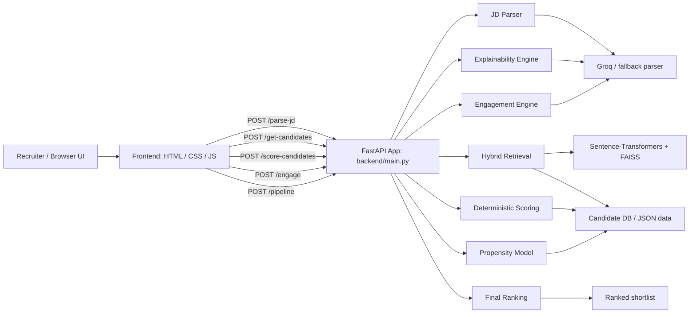

# ScoutAI — Agentic Hybrid-RAG Recruitment Engine

ScoutAI is an advanced AI recruitment engine designed to automate the screening and ranking of job applicants. It leverages **FastAPI**, **FAISS**, and **Groq (Mixtral)** to perform hybrid search (semantic + keyword), candidate scoring, and engagement simulation, using fast cloud inference.

## 🌟 Key Features

*   **Job Description Parsing**: Automatically extracts key skills and requirements from unstructured job descriptions using Groq/Mixtral.
*   **Hybrid-RAG Candidate Retrieval**: Uses FAISS vector search combined with keyword matching to find the most relevant candidates from the database.
*   **Intelligent Scoring**: Evaluates candidates based on skill overlap, experience level, and semantic fit.
*   **Agentic Profiling**: Computes the candidate's "propensity to switch" jobs and generates personalized "engagement messages" for recruiters to use.
*   **Explainable AI**: Provides a transparent, human-readable reason for why each candidate was matched to the role.
*   **Premium Local UI**: A beautiful, dark-mode glassmorphic frontend built with pure HTML/CSS/JS that interacts directly with the local FastAPI backend.
*   **Fast Inference**: Powered by Groq Cloud and Sentence-Transformers.

## 🛠️ Tech Stack

*   **Backend**: Python, FastAPI
*   **Frontend**: HTML5, Vanilla CSS (Glassmorphism), Vanilla JavaScript
*   **AI/ML**: Groq API (Mixtral 8x7B), `sentence-transformers` (`all-MiniLM-L6-v2`)
*   **Vector Database**: FAISS (CPU)

## 🚀 Getting Started

### Prerequisites

1.  **Python 3.9+** installed.
2.  **Groq API Key**.
    *   Create a `.env` file in the root directory and add `GROQ_API_KEY=your_key_here`.

### Installation

1.  **Clone the repository:**
    ```bash
    git clone https://github.com/yourusername/scoutai.git
    cd scoutai
    ```

2.  **Set up a virtual environment:**
    ```bash
    python -m venv venv
    # On Windows:
    venv\Scripts\activate
    # On macOS/Linux:
    source venv/bin/activate
    ```

3.  **Install dependencies:**
    ```bash
    pip install -r requirements.txt
    ```

### Running the App

1.  Ensure you have added your **Groq API Key** to the `.env` file.
2.  Start the **FastAPI** backend:
    ```bash
    uvicorn backend.main:app --reload --port 8000
    ```
3.  Open your browser and navigate to: [http://localhost:8000](http://localhost:8000)

## 📁 Project Structure

```text
scoutai/
├── backend/                  # FastAPI Application
│   ├── modules/              # Core Logic (Parsing, Retrieval, Scoring, etc.)
│   ├── main.py               # API Endpoints
│   ├── config.py             # Configuration and Weights
│   └── llm_client.py         # Groq API Wrapper
├── frontend/                 # UI Assets
│   ├── index.html
│   ├── style.css
│   └── app.js
├── data/                     # Mock Candidate Database
├── requirements.txt
└── README.md
```

### What Each File Does

| Path | Purpose |
| --- | --- |
| [add_candidates.py](/workspaces/scoutai/add_candidates.py) | Utility script that appends synthetic candidate records to `data/candidates.json` for demos and testing. |
| [README.md](/workspaces/scoutai/README.md) | Project overview, setup instructions, architecture, and scoring documentation. |
| [render.yaml](/workspaces/scoutai/render.yaml) | Deployment configuration for Render. |
| [requirements.txt](/workspaces/scoutai/requirements.txt) | Python dependencies needed to run the backend and supporting scripts. |
| [test_groq.py](/workspaces/scoutai/test_groq.py) | Simple connectivity check for the Groq API and environment setup. |
| [backend/__init__.py](/workspaces/scoutai/backend/__init__.py) | Marks the backend directory as a Python package. |
| [backend/config.py](/workspaces/scoutai/backend/config.py) | Central configuration for API keys, model names, paths, retrieval limits, and scoring weights. |
| [backend/embeddings.py](/workspaces/scoutai/backend/embeddings.py) | Embedding manager and FAISS index wrapper used for vector search. |
| [backend/llm_client.py](/workspaces/scoutai/backend/llm_client.py) | Groq client wrapper with text and JSON generation helpers plus fallback handling. |
| [backend/main.py](/workspaces/scoutai/backend/main.py) | FastAPI entrypoint and API routes that orchestrate the full recruitment pipeline. |
| [backend/modules/__init__.py](/workspaces/scoutai/backend/modules/__init__.py) | Marks the modules subdirectory as a Python package. |
| [backend/modules/candidate_db.py](/workspaces/scoutai/backend/modules/candidate_db.py) | Loads candidate data from JSON and provides lookup helpers. |
| [backend/modules/engagement.py](/workspaces/scoutai/backend/modules/engagement.py) | Generates outreach messages and simulates candidate interest responses. |
| [backend/modules/explainability.py](/workspaces/scoutai/backend/modules/explainability.py) | Produces human-readable explanations for why each candidate matched. |
| [backend/modules/jd_parser.py](/workspaces/scoutai/backend/modules/jd_parser.py) | Parses raw job descriptions into structured requirements. |
| [backend/modules/propensity.py](/workspaces/scoutai/backend/modules/propensity.py) | Estimates how likely a candidate is to be open to a move based on tenure. |
| [backend/modules/ranking.py](/workspaces/scoutai/backend/modules/ranking.py) | Combines match, propensity, and interest into the final ranked shortlist. |
| [backend/modules/resume_parser.py](/workspaces/scoutai/backend/modules/resume_parser.py) | Parses resume text into structured candidate data. |
| [backend/modules/retrieval.py](/workspaces/scoutai/backend/modules/retrieval.py) | Performs hybrid retrieval using FAISS similarity, keyword overlap, and rank fusion. |
| [backend/modules/scoring.py](/workspaces/scoutai/backend/modules/scoring.py) | Computes skill, experience, semantic, and overall match scores. |
| [frontend/index.html](/workspaces/scoutai/frontend/index.html) | Main UI shell for the recruiter-facing web app. |
| [frontend/style.css](/workspaces/scoutai/frontend/style.css) | Visual design system, layout, and responsive styling for the frontend. |
| [frontend/app.js](/workspaces/scoutai/frontend/app.js) | Frontend behavior for health checks, pipeline execution, and result rendering. |
| [data/candidates.json](/workspaces/scoutai/data/candidates.json) | Mock candidate dataset used by the backend pipeline. |

## 🧭 Architecture & Scoring Logic

### System Architecture



### End-to-End Flow

1. The browser UI sends a job description to the FastAPI backend.
2. The JD parser extracts a structured role, must-have skills, nice-to-have skills, and required experience.
3. Hybrid retrieval narrows the candidate pool using two signals:
   - semantic similarity from embeddings + FAISS
   - keyword overlap between JD skills and candidate skills
4. The scoring module computes a deterministic match score for each shortlisted candidate.
5. The propensity module estimates how open each candidate may be to moving jobs.
6. The explainability and engagement modules generate recruiter-facing rationale and outreach.
7. The ranking module combines all signals into the final ordered shortlist.

### Scoring Breakdown

The scoring pipeline is intentionally layered:

- Skill score: overlap between JD must-have skills and candidate skills, with a small boost if matched skills appear in the candidate’s most recent work context.
- Experience score: how closely the candidate’s years of experience match the JD requirement, with a capped bonus for exceeding the requirement.
- Semantic score: the vector retrieval similarity score, normalized to a 0–100 range.

The match score is computed as:

`match_score = 0.5 * skill_score + 0.3 * experience_score + 0.2 * semantic_score`

Hybrid retrieval uses reciprocal rank fusion, so candidates can surface through either vector similarity or keyword overlap.

### Final Ranking

The final shortlist score combines match quality, switching propensity, and simulated interest:

`final_score = 0.6 * match_score + 0.2 * propensity_score + 0.2 * interest_score`

Interest is derived from the engagement step, which either uses Groq-backed simulation or a deterministic fallback based on propensity.

### Fallback Behavior

When Groq is unavailable, the system still works end-to-end:

- JD parsing falls back to deterministic text heuristics.
- Explanations fall back to skill intersection and resume sentence matching.
- Outreach messages fall back to templated recruiter text.
- Candidate responses fall back to propensity-based response templates.

This makes the project resilient in demo or offline environments while preserving the same overall architecture.

## ⚖️ Hackathon Disclaimer

This tool is built as a proof-of-concept for a hackathon. AI-generated scores and explanations are for screening assistance only. All rankings should be reviewed by a human recruiter before making hiring decisions to prevent bias.
